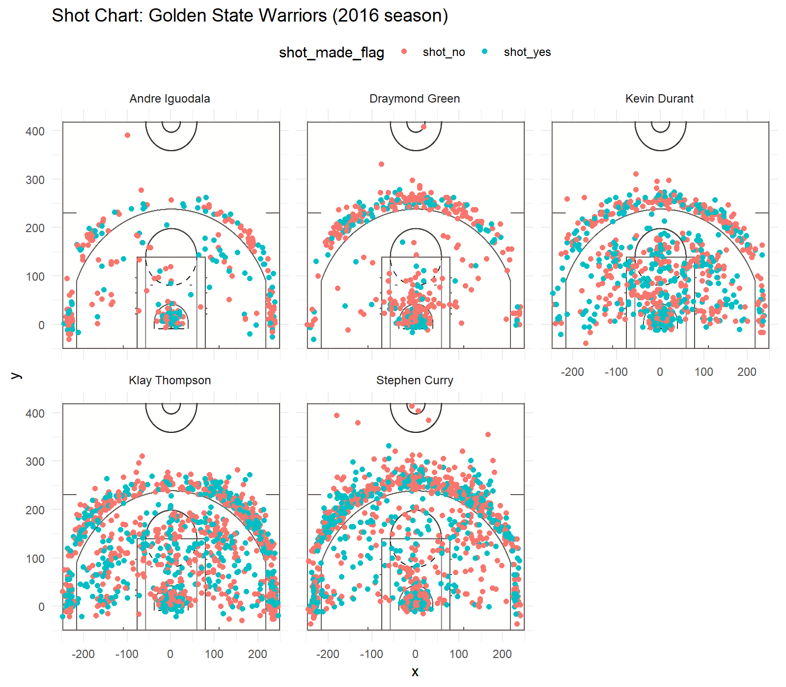

```{r setup, include=FALSE}
library(knitr)
library(dplyr)
library(png)
library(jpeg)
```

```{r echo = FALSE}

#this is to import data and make tables.

colclass <- c(
  rep("character",3),
  rep("integer",3), 
  rep("factor",3), 
  "integer", 
  "factor", 
  rep("integer",2),
  "factor",
  "integer"
)

shots <- read.csv(file = "../output/shots-data.csv", colClasses = colclass)
shots <- select(shots, c(name, shot_type, shot_made_flag, y))

# create data frame for Overall Effective shooting percent

st1 <- shots %>% group_by(name) %>% tally() 
st2 <- shots %>% filter(shot_made_flag == "shot_yes") %>% group_by(name) %>% tally()
st <- mutate(st1, made = st2$n)
names(st) <-  c("name", "total", "made")
st <- st %>% mutate(percent_made  = made/total*100) %>% arrange(desc(percent_made))

# create data frame for 2PT Effective shooting percent

s2pt1 <- shots %>% filter(shot_type == "2PT Field Goal")  %>% group_by(name) %>% tally()
s2pt2 <- shots %>% filter(shot_made_flag == "shot_yes" & shot_type == "2PT Field Goal") %>% group_by(name) %>% tally()
s2pt <- mutate(s2pt1, made = s2pt2$n)
names(s2pt) <-  c("name", "total", "made")
s2pt <- s2pt %>% mutate(percent_made  = made/total*100) %>% arrange(desc(percent_made))

# create data frame fot 3PT Effective shooting percent

s3pt1 <- shots %>% filter(shot_type == "3PT Field Goal") %>% group_by(name) %>% tally()
s3pt2 <- shots %>% filter(shot_made_flag == "shot_yes" & shot_type == "3PT Field Goal") %>% group_by(name) %>% tally()
s3pt <- mutate(s3pt1, made = s3pt2$n)
names(s3pt) <-  c("name", "total", "made")
s3pt <- s3pt %>% mutate(percent_made  = made/total*100) %>% arrange(desc(percent_made))

#table for shots close to half court (y > 250)
fs1 <- shots %>% filter(y >= 250) %>% group_by(name) %>% tally()
fs2 <- shots %>% filter(y >= 250 & shot_made_flag == "shot_yes") %>% group_by(name) %>% tally()
names(fs1) <- c("name", "total")
fs1$made <- fs2$n
fs <- fs1 %>% mutate(percent_made = made/total) %>% arrange(desc(percent_made))
```


The Golden State Warriors have become a sensation in the NBA. In the 2016 season they [beat the record](https://www.basketball-reference.com/leagues/NBA_best_records.html) for the best season and best start (going 73-9 for the 2016 season and starting 24-0). It’s hard to be in the Bay Area and ignore the presence of the “Dubs”. 

The Star player during all of this: Stephen Curry. Who was breaking individual player records in making the most 3 pointers in a regular season and tied for most three pointers in a single game. All of this along with his ["Splash Brother"](https://en.wikipedia.org/wiki/Splash_Brothers) Klay Thompson.  

However, It’s not all about the Splash Brothers. Let’s break down the statistics of the Golden State Warriors’ “death lineup”  for the 2016 season.

```{r echo = FALSE, align = "center"}
knitr::include_graphics("../images/Stephen-Curry-Draymond-Green-Kevin-Durant-Klay-Thompson-Andre-Iguodala-warriors.jpg")
```
from left to right: Curry, Green, Durant, Thompson, and Iguodala

# Shot Charts:

First, we're going to look at the player's behavior on the court. To aid us, I've made the chart of half-court shooting data below. (shot_made_flag is an indicator of wether the attempted shot scored)

```{r out.width = "95%", echo = FALSE, align = "center"}

```

So what can we say about the players from looking at these? First, for Durant Thompson and Curry, they are shooting in the midrange frequently, while Iguodala and Green favor eighter shots on the 3pt line or under the basket, especially Green. Second, Curry seems more willing to attempt shots closer to half court. This does not lead to a scored basket the majority of the time, but it says he's willing to take the risk. It could also be that he is the main shooter and often has the ball at the end of periods and so is forced to take the shot. 

# Effective Shooting Percentages:

### Effectiveness at long distance

Now, let's actually see if Curry performs at long distance compared to the rest of the lineup. Below is a table of each player's shooting percent when they are farther than 250 in away from the basket

```{r echo = FALSE}
kable(fs, caption = "ordered by percentage of effective shots")
```

Curry actually places third among his teamates, behind Klay Thompson and Kevin Durant. However, he is making more shots overall because he is attempting more than twice anyone else. Klay Thompson is the most effective at this range filling in the Gap of his "Splash Brother". Not to say these shots are easy to make, both players are performing very well. 

### How about overall effectiveness?

Below is a table from the same data source, but now we aren't restricting it to shots far away from the basket. So how do the star players hold up?

```{r echo = FALSE}
kable(st, caption = "ordered by percentage of effective shots")
```

Stephen Curry and Klay Thompson are now towards the bottom of the table, with Kevin Durant taking the lead: a surprise upset. This trend is continued if we only look at two pointers

### Two pointers

```{r echo = FALSE}
kable(s2pt, caption = "ordered by effective shooting percentages")
```

Except now Iguodala leads the pack in effectiveness.

### Three Pointers

But what about three pointers, Curry's staple?

```{r echo = FALSE}
kable(s3pt)
```

Here the "Splash Brothers" are in the lead with Kevin Durant close behind. Notice that While Clay is more effective at making shots, he has made less then Curry. This suggests a more reckless shooting style for curry.


# Conclusion: 
