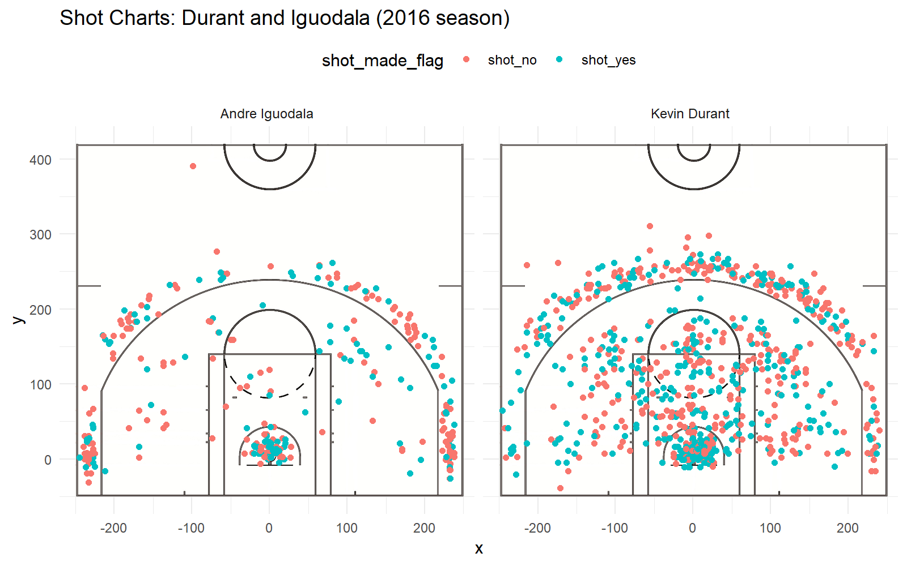

The Warriors’ Star Lineup (Iguodala, Green, Durant, Thompson, Curry)
================
Andrea (Drew) Galloro

The Golden State Warriors have become a sensation in the NBA. In the
2016 season they [beat the
record](https://www.basketball-reference.com/leagues/NBA_best_records.html)
for the best season and best start (going 73-9 for the 2016 season and
starting 24-0). It’s hard to be in the Bay Area and ignore the presence
of the “Dubs”.

The Star player during all of this: Stephen Curry. Who was breaking
individual player records in making the most 3 pointers in a regular
season and tied for most three pointers in a single game. All of this
along with his [“Splash
Brother”](https://en.wikipedia.org/wiki/Splash_Brothers) Klay
Thompson.

However, It’s not all about the Splash Brothers. Let’s break down the
statistics of the Golden State Warriors’ “death lineup” for the 2016
season.

<!-- -->
from left to right: Curry, Green, Durant, Thompson, and Iguodala

# Shot Charts:

First, we’re going to look at the player’s behavior on the court. To aid
us, I’ve made the chart of half-court shooting data below.
(shot\_made\_flag is an indicator of wether the attempted shot scored)

So what can we say about the players from looking at these? First, for
Durant Thompson and Curry, they are shooting in the midrange frequently,
while Iguodala and Green favor eighter shots on the 3pt line or under
the basket, especially Green. Second, Curry seems more willing to
attempt shots closer to half court. This does not lead to a scored
basket the majority of the time, but it says he’s willing to take the
risk. It could also be that he is the main shooter and often has the
ball at the end of periods and so is forced to take the shot.

# Effective Shooting Percentages:

### Effectiveness at long distance

Now, let’s actually see if Curry performs at long distance compared to
the rest of the lineup. Below is a table of each player’s shooting
percent when they are farther than 250 in away from the basket

| name           | total | made | percent\_made |
| :------------- | ----: | ---: | ------------: |
| Klay Thompson  |    59 |   23 |     0.3898305 |
| Kevin Durant   |    56 |   19 |     0.3392857 |
| Stephen Curry  |   177 |   59 |     0.3333333 |
| Draymond Green |    67 |   17 |     0.2537313 |
| Andre Iguodala |     8 |    2 |     0.2500000 |

ordered by percentage of effective shots

Curry actually places third among his teamates, behind Klay Thompson and
Kevin Durant. However, he is making more shots overall because he is
attempting more than twice anyone else. Klay Thompson is the most
effective at this range filling in the Gap of his “Splash Brother”. Not
to say these shots are easy to make, both players are performing very
well.

### How about overall effectiveness?

Below is a table from the same data source, but now we aren’t
restricting it to shots far away from the basket. So how do the star
players hold up?

| name           | total | made | percent\_made |
| :------------- | ----: | ---: | ------------: |
| Kevin Durant   |   915 |  495 |      54.09836 |
| Andre Iguodala |   371 |  192 |      51.75202 |
| Klay Thompson  |  1220 |  575 |      47.13115 |
| Stephen Curry  |  1250 |  584 |      46.72000 |
| Draymond Green |   578 |  245 |      42.38754 |

ordered by percentage of effective shots

Stephen Curry and Klay Thompson are now towards the bottom of the table,
with Kevin Durant taking the lead: a surprise upset. This trend is
continued if we only look at two pointers

### Two pointers

| name           | total | made | percent\_made |
| :------------- | ----: | ---: | ------------: |
| Andre Iguodala |   210 |  134 |      63.80952 |
| Kevin Durant   |   643 |  390 |      60.65319 |
| Stephen Curry  |   563 |  304 |      53.99645 |
| Klay Thompson  |   640 |  329 |      51.40625 |
| Draymond Green |   346 |  171 |      49.42197 |

ordered by effective shooting percentages

Except now Iguodala leads the pack in effectiveness. If we return to his
and Durant’s shot charts, Durant is more willing to shoot at the
midrange, while Iguodala is more willing to shoot under the basket. (See
Below)

### Three Pointers

But what about three pointers, Curry’s staple?

| name           | total | made | percent\_made |
| :------------- | ----: | ---: | ------------: |
| Klay Thompson  |   580 |  246 |      42.41379 |
| Stephen Curry  |   687 |  280 |      40.75691 |
| Kevin Durant   |   272 |  105 |      38.60294 |
| Andre Iguodala |   161 |   58 |      36.02484 |
| Draymond Green |   232 |   74 |      31.89655 |

Here the “Splash Brothers” are in the lead with Kevin Durant close
behind. Notice that While Clay is more effective at making shots, he has
made less then Curry. This suggests a more reckless shooting style for
curry.

# Conclusion:

Runninng this aggressive lineup worked very well for the Warriors in the
2016 season. It’s clear why. Curry and Thompson are aggressive three
point shooters and willing to shoot in the midrange if needed. Whereas
durant and Iguodala are very effective at getting in close to the basket
and making two point shots.
